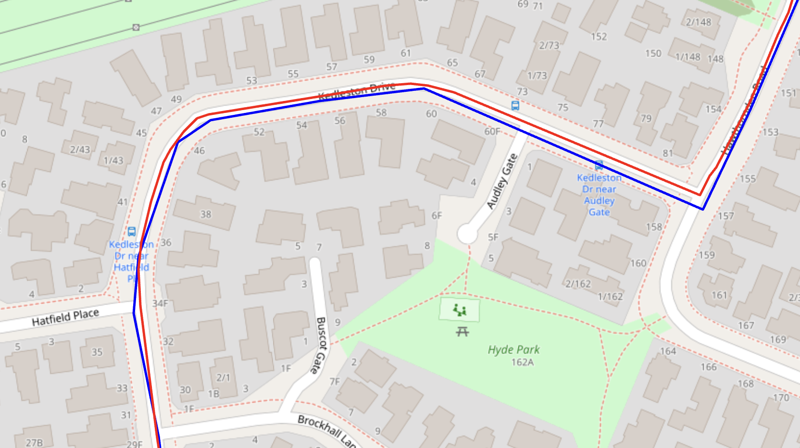

# metro-map-matching

A mini-project to play around with [Valhalla](https://valhalla.github.io/valhalla/) and using its [map matching APIs](https://valhalla.github.io/valhalla/api/map-matching/api-reference/) to correct Christchurch Metro's static GTFS shapes.

The static GTFS shapes were likely derived from existing GPS route data and often do not adhere directly to roads, which map matching (or [Snap to Roads](https://developers.google.com/maps/documentation/roads/snap)) aims to solve. In the example below, the blue line is the existing shape, and the red line is the map matched shape:

## Brief

Rough outline for the project:

- Download Christchurch's GTFS feed
- Snap bus shapes to OSM roads
    - Use a local Valhalla instance
- Aim to have an accurate and reproducible output
    - Output should be a new GTFS feed with improved shapes
        - Shapes: paths the public transport vehicles are scheduled to follow
            - Encoded in the `shapes.txt` file in GTFS
        - Reproduce a gtfs.zip

## Running the project

Coming soon
